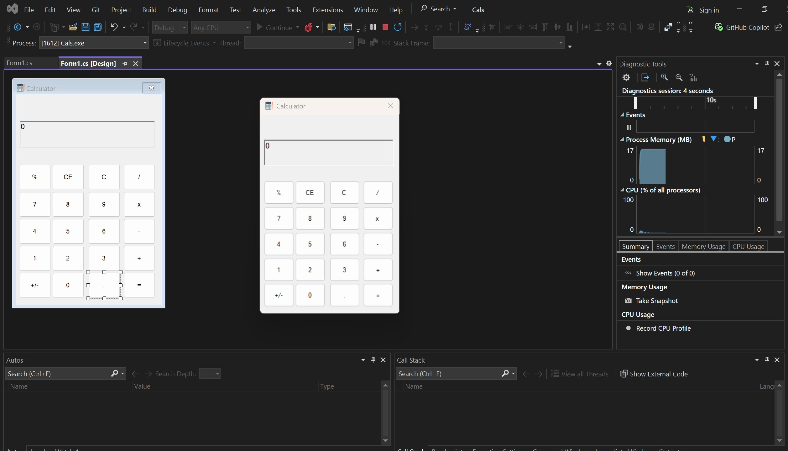

# 🧮 Windows Forms Calculator

This is a simple calculator application built using **C#** and **Windows Forms**. It supports basic arithmetic operations such as addition, subtraction, multiplication, division, and percentage, with a user-friendly interface and input validation logic.

---

## ✨ Features

- ✅ Add, Subtract, Multiply, Divide
- ✅ Toggle +/- sign
- ✅ Percentage calculation
- ✅ Decimal point support (one per number)
- ✅ Prevents invalid operator duplication
- ✅ Displays results with "Answer:" prefix
- ✅ Handles and shows basic errors gracefully

---

## 💻 Technologies Used

- Language: **C#**
- Framework: **.NET Framework**
- GUI: **Windows Forms**

---

## 🔢 Supported Operations

| Button | Function |
|--------|----------|
| `0-9`  | Number input |
| `+ - × ÷` | Basic arithmetic |
| `.`    | Decimal point (one per number segment) |
| `+/-`  | Toggle positive/negative |
| `%`    | Converts current number to percentage (e.g., `25 → 0.25`) |
| `=` / `Answer` | Evaluates the expression and shows the result |
| `C`    | Clears current input and shows `0` |
| `<--`  | Backspace: removes one character at a time |

---

## 🧠 Example Behaviors

- Input: `12 + 7` → Click `=` → Output: `Answer: 19`
- Input: `50` → Click `%` → Output: `Answer: 0.5`
- Input: `-23` → Click `+/-` → Output: `23`

---

## 🛠 How to Run

1. Open the project in **Visual Studio**.
2. Build the solution.
3. Run the app (`F5` or click the Start button).
4. Use the on-screen buttons to perform calculations.

---

## 📁 File Structure

- `Form1.cs` – Main form UI and logic
- `Program.cs` – Entry point
- `README.md` – This file

---

## 🚀 Future Improvements

- Advanced math (sin, cos, log, etc.)
- Keyboard input support
- Expression history
- Dark mode toggle

---

# 🧮 Windows Forms Calculator

A simple and clean calculator built with C# Windows Forms.

---

---

## 🔽 Download

> 📌 Replace the image path and link with your actual screenshot and file hosting URL.

## 📜 License

This project is open-source and free to use.

---

## 🙌 Author

Developed by [Halim].

